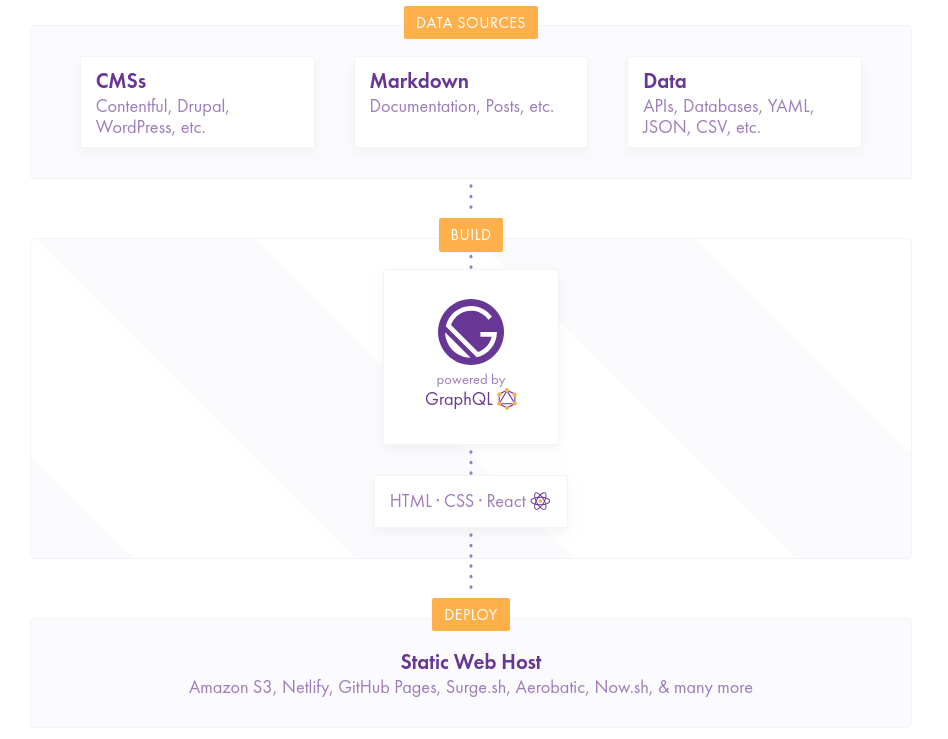

はじめまして。このブログの筆者のううたろ(またの名をモガミン)と言います。  
私は、現在大学4年のWebエンジニア見習いです。

私に関しては[About](/about)に詳しく書いておいたのでもしよろしければご覧ください。

---

普段は[ゆるふわ技術日誌](https://yurufuwa-tech.hatenablog.com)というブログを書いています。原則毎日、その日にやったことなどを書いています。  
もうかれこれ1年以上そんな生活を続けているのですが、どうしても毎日書くと内容が薄くなりがちな点が最近は悩みになっていたので、そのブログとは別に以前から使ってみたかったGatsbyとNetlifyを使ってブログを作ってみたので、やったことや悩んだ部分などをこの記事にはまとめていきます。

# Gatsbyとは
やったことを紹介する前に軽くGatsbyとはなんぞや、というところを紹介してみます。(とはいえ、この辺の情報に関しては他のサイトをご覧頂いた方が詳しい/わかりやすいかもしれないので、併せてご覧ください)

まず、公式サイトは以下にあります。

[GatsbyJS](https://www.gatsbyjs.org/)

一言で言うと、いわゆる静的サイトジェネレーターの一種です。(RubyならJekyll、Node.jsならHexo、GolangならHugoなどなど…多分星の数ほどある気がする。)

GatsbyもHexoと同様にJavaScriptを用いて作られている静的サイトジェネレーターであるという点は変わりないのですが、**バックエンドにReactやGraphQL**が使用されているという点が大きな特徴として存在します。

通常の静的サイトジェネレーターでは、Viewを作るのにテンプレートエンジンが用いられていることが一般的ですが、GatsbyではReactを用いてViewの構築を行います。

では、GraphQLはどこで用いるのかというと、データソースからViewを作るのに必要な情報を抜き出す為に用いられれます。以下は公式サイトの図です。

図にもあるように、Gatsbyでは様々なものをデータソースとすることができます。それらのソースからViewを描画するのに必要となる情報を抜き出すという目的でGraphQLは用いられています。

# 実際に作ってみた
今まさにご覧頂いているサイトが、実際にGatsbyを用いて作られています。

試行錯誤しながら書いたため、必ずしもベストプラクティスが適用されているとも言えず、結構恥ずかしいことになっている箇所もありますが、(随時直します…!)以下がこのブログのリポジトリです。

[uutarou10/mogam.in: My site build by Gatsby](https://github.com/uutarou10/mogam.in)

## ざっくりとした手順
Gatsbyの使い方を知らない状態からひとまずこのブログを作り上げるまでにやったことは以下のような感じです。

- [公式チュートリアル](https://www.gatsbyjs.org/tutorial/)をやった
  - 全部で7章構成になっています。Node.jsやReactの基本的な知識があれば全部やっても2時間から3時間位で終えることができるボリュームだと思います。
  - 最後までやるとブログを作ることができるようになります。
- starterを試した
  - Gatsbyにはstarterと呼ばれるboilerplateのようなものがあります。
  - [Gatsby Starters | GatsbyJS](https://www.gatsbyjs.org/docs/gatsby-starters/) これが一覧。
  - チュートリアルでは一貫して[gatsby-starter-hello-world](https://github.com/gatsbyjs/gatsby-starter-hello-world)という最低限のものが入ったstarterを使用してきましたが、公式/非公式のstarterが数多く用意されています。
  - ブログを作るにあたって、あると便利なPluginが最初から設定されているstarterなどが複数あるので、いくつか試してみて知らないpluginを見かけたらググったりしながら、どのstarterを使うか、或いは完全に自力で頑張ったほうが良いかなどを判断
  - 結果としてこのブログでは[gatsby-starter-blog-no-styles](https://github.com/noahg/gatsby-starter-blog-no-styles)というstarterを使用しました。
      - 最低限必要となるPluginは入っていることが確認できた点とBulma(CSSフレームワーク)を使ってみたかったというのが理由
- 頑張ってコードを書く
  - 前述の通りスタイルが一切当たっていないStarterを使用したため、まずは既存のサンプル記事が正しく表示されるようにスタイルを当てた
  - CSSがあまり得意ではないのに加え、あまり時間をかけて作っている場合でもなかったのでBulmaのスタイルで対応できる箇所はなるべくそれだけで済ませてどうしても自力でスタイルを当てる必要がある箇所については[styled-components](https://github.com/styled-components/styled-components)を使用してコンポーネント単位でCSSを書いた
  - starterには記事にtagをつける機能がなかったので追加
      - (間に合ってなくてまだないのですが)将来的にタグ一覧やタグに紐づく記事のページを作る際に、記事のslugが`/(記事のslug)`だと不都合が生じるのではないかと思ったので、記事のslugを`/posts/(記事のslug)`になるように変更
  - [/about](/about)のページを追加
      - starterにはないページを作ろうと思い追加。
      - ページ内のプロフィール情報はYAMLで書いてそれを読み込んで生成するようにしてみた(Markdown以外をsourceとして使ってみたかったというだけ)
- デプロイ
  - 流行りのNetlifyを使用

思い出しつつ書いたので抜けているかもしれないがざっくりとこんな流れで作っていった。

私はReact/GraphQLに関しての最低限の知識は持ち合わせていたので、あまりドハマりすることなどはなく実装をすすめることができた。強いて言うのであれば、作業環境のインターネット回線がやたら弱くBulmaのドキュメントがさくさく見れなくて(心が)キツかったくらいだろうか。

# やってみてどうだったか
先にも挙げたが世の中には星の数ほどの静的サイトジェネレーターがある。

過去に、このようなブログや研究室のサイトを作る際などにJekyllを使ってみようとしたこともあったが、なんとも言えない不毛さを感じて投げ出したことがある。既存のテーマを引っ張ってきて編集するにしても入り組んでいて構造を理解するので一苦労みたいな記憶があるし、かといってイチからつくりあげようとするとそれはそれで、既存のテーマの構造を理解する以上の理解が求められるので、サイトを作りたいという目的のためだけにそこまでしたくなかった。

(既存の静的サイトジェネレーターを批判する目的があるわけではないし、単純なブログであれば既存のものを持ってくれば中身の理解をする必要はないのでもしかするとGatsbyより楽かもしれない。要は適材適所なんだと思う。私はある程度カスタマイズがしたいと思ったので向いてなかったという話。)

その点をGatsbyはうまいこと乗り越えているのではないかと感じた。

実際にやってみるとわかるが、Gatsby独特の知識が必要となるのはconfigや動的にページを生成する処理を書く部分だけで、あとはGraphQLを用いてページを表示するのに必要な情報を取得し、取得された情報はReact ComponentのPropsに渡されるのでそのデータを使ってViewを生成するだけという具合になっている。(ちなみに、そのconfigやページ生成処理はstarterに含まれていたりするので、書かなくて済む場合や、少しの修正で済む場合も多い)

もちろんReactやGraphQLの知識は必要となるが、近年のフロントエンド界隈ではスタンダードになりつつある組み合わせだと思うので、既に使える人も多いだろうし、新たに勉強したとしても他への知識の転用ができるので、"不毛な学習コストを払ってる感"は薄いのではないかと思う。

以上のような点から私はとても気に入ったが、フロントエンド界隈の外にいる人たちからするとお手軽感は薄く、高めの学習コストを払う羽目になるのかもしれないので万人に勧められるかは微妙かと思った。